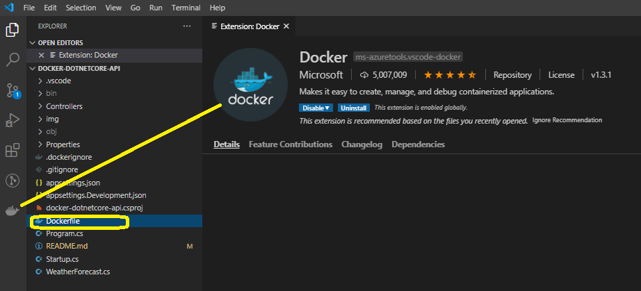

# **docker-dotnetcore-api**
Step-by-Step how-to build and package a .NET Core API as a Docker image, then deploy and spin that image up as Container on Windows, Linux hosts.

# **What is Docker?**
Docker is a **"containerization"** platform, enabling to package applications into images and run them as **“containers”** on any platform that can run Docker. So “It works on my local” argument is an empty word with Docker, as Docker images contain everything needed for the app to run. Cute!

# Containers vs. Virtual Machines
In short;
- Virtual Machines provide OS Level Virtualisation
- Containers provide App Level Virtualisation


*ref* https://cloudblogs.microsoft.com/opensource/2019/07/15/how-to-get-started-containers-docker-kubernetes/

# Why Use Docker?
- Portability : Containers are self-contained so they can run on any platform that runs Docker.
- Scalability : Additional use of **“orchestration”** can spin up multiple container instances to support increased load.
- Performance : Containers generally perform better than their VM counterparts.

# Image
A docker image is a file that contains the “blueprint” or instructions on how our code is expected to run in Docker, so it includes things like dependencies and instructions on how our app should start.

# Container
When an image is “executed to run”, in runs in a container, which is highly portable and independent, (from any other running containers). We can think an image as a class and a container as an object instance of that class.

# Overall Docker Deployment Flow


# **End to End Steps**

## **Step 0 - Prepare Ingredients**
 - VS Code or another IDE of your choice (free) [https://code.visualstudio.com/](https://code.visualstudio.com/)
 - .NET Core SDK (free)
 - Docker Desktop (free) [https://www.docker.com/products/docker-desktop](https://www.docker.com/products/docker-desktop)
 - Docker Hub Account (free) [https://hub.docker.com/] (https://hub.docker.com/)
 - *(optional)* Some local machine to test your deployment

## **Step 1 - Create the API**
### *1.1 - Create an Application*

```sh
$ dotnet new webapi -n docker-dotnetcore-api
```

### *1.2 - Build the Application*

```sh
$ cd docker-dotnetcore-api
$ dotnet build
```

### *1.3 - Run the Application*

```sh
$ dotnet run
```

### *1.4 - Test the Application*

Open the following URL in a browser

```sh
https://localhost:5001/WeatherForecast
```


## **Step 2 - Create Docker Image**
To run an app in Docker we need to create an image, we do this by a “Dockerfile”. The Dockerfile defines the image to be created.

- Define our Dockerfile

- Using the Docker CLI will issue a “build” command
- The Docker engine will parse the file
- The Docker engine will create an image ready for use

### *2.1 - Create Dockerfile*

Add a file named Dockerfile (without any extension) in the root project folder.

**Tip :** Visual Studio Code has an extension which provides Dockerfile sytnax parsing and IntelliSense




#### Dockerfile


Line by Line explanation;

- **Line 2:**  Grab the .NET SDK from Microsoft, so that the Docker Engine can compile the app.

  > <!--* The Docker Engine builds up an image in stages by using an empty container at each stage and working inside that. Therefore we have to assume that the container environment is “empty”, hence why we need to pull down the .NET SDK base image to allow for the compilation of our app.-->

- **Line 3:** Specify a dedicated “working directory” where the app will reside in the container

- **Line 6:** Copy the .csproj file from our local machine to the working container directory (/app)

- **Line 7:** Run *dotnet restore* to resolve project dependencies (this is done using the .csproj file and retrieving any additional dependencies via Nuget)

- **Line 10:** Copy the rest of our project files into our working directory, so we can build the app

- **Line 11:** Run the *dotnet publish* command, specifying that it is a Release build, (*-c Release*), as well as specifying a folder, (***out***), to contain the app build dll and any support files & libraries.

- [^]: At this stage we have completed building our app

- **Line 14:** To keep our image “lean” we retrieve only the aspnet run time image, (as opposed to the full SDK image we used for building), as this is all our app requires to “run”.

- **Line 15:** Re-specify our working directory

- **Line 16:** Expose the port to use from *inside* our app

- **Line 17:** Copy the relevant files from both the dependency resolution step, (*build-env*), and build step, (**/app/out**), to our working directory **/app**

- **Line 18:** Set the entry point for the app, (i.e. what should start), in this case it’s our published .dll using “dotnet”.


#### .dockerignore

To minimise the footprint of the image, we include a file in the root of our project called: ***.dockerignore***. Add to this file the following contents:


### *2.2 - Build (Create) Image*

Use the following Docker CLI command to build the image by Docker Engine.

```
$ docker build -t ersenbasaransen/docket-dotnercore-api .
```

The standard Docker Image naming convention is like this;

<Docker Hub ID>/<Project Name>:<Version>

In my case it is ersenbasaransen/docket-dotnercore-api. In your case give a name that suits you best.

If you omit the version component Docker engine will default it to *"latest"*. You can even omit Docker Hub ID, in this case the image will be generated with a unique id. Bu it is useful to provide the standard naming if this image will be pushed to Docker Hub for deployment.

docker build command will build and tag the image.

### *2.3 - See the Docker Images in your system*

```
$ docker images
```


## **Step 3 - Run the App in Local Docker Container**

 

### *3.1 - Run On Localhost*

```
$ docker run -p 8080:80 ersenbasaransen/docker-dotnetcore-api
```


Now the image is running as a container.

**The “-p” flag** – this is a port-mapping, in this case it’s saying map port 8080 on local PC to port 80 of the container. So to access the api, we need to use port 8080 as follows:


This will map through to the “Exposed” port 80 specified in the Dockerfile, you should see the same output as before.

### *3.2 - See the Currently Running Container*

```
$ docker ps
```


If your are using VS Code and installed the Docker extension I mentioned above you can also see the running containers as well!


### *3.3 - Stopping the Container*

```
$ docker stop <ContainerId>
```


You can also use the VS Code Docker extension to do so!

